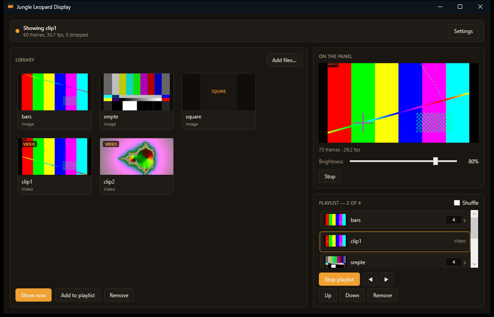
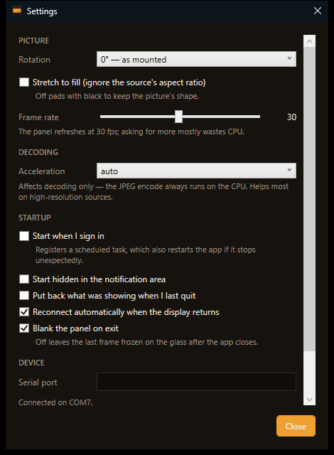

# Jungle Leopard Display

Drive a **TZMRIT PF360 / "Jungle Leopard" pump LCD** — the 960×480 panel on the
head of an AIO cooler — from Windows, without the vendor's Electron app.

Ships two programs over one shared core:

- **Display Manager** — a tray app that holds the panel permanently, with a
  media library, a playlist, a live preview of what's on the glass, and an
  optional start-at-logon task.
- **`Jungle Leopard Display.exe`** — the original command-line tool, for
  scripting and one-shot use.



The protocol was recovered from the vendor app's `resources/app.asar`
(`main/_baseClass/device.js`) and verified against firmware **3.1**, model
`TXW818-ST7701S-5.5inch-hor`. See [Protocol notes](#protocol-notes).

---

## Requirements

| | |
|---|---|
| **OS** | Windows 10/11, **x64 only** |
| **Runtime** | [.NET 9 Desktop Runtime](https://dotnet.microsoft.com/download/dotnet/9.0) — for the manager only; the CLI is native |
| **ffmpeg** | `winget install "FFmpeg (Essentials Build)"`, or drop `ffmpeg.exe` beside the binaries |
| **Build** | Visual Studio 2022 (v143 toolset) + .NET 9 SDK |

ffmpeg does all transcoding. Without it, the only thing that can be displayed is
an image that is *already* a 960×480 JPEG under 80 KB. `ffprobe` is optional —
without it, calibration reports elapsed time instead of progress.

> **Only one process can hold the panel at a time.** Close the vendor app before
> using either program, and don't run the CLI and the manager together — the
> manager has a **Release device** button for exactly this.

---

## Building

```sh
msbuild "Jungle Leopard Display.sln" -p:Configuration=Release -p:Platform=x64 -restore
```

Everything lands in `x64\Release\`, native and managed together, so
`DllImport` resolves with no probing paths.

---

## Using the manager

Run `x64\Release\JungleLeopardDisplayManager.exe`. It finds the panel by
hardware ID, connects, and sits in the notification area.

- **Add files…**, or drag images and videos onto the window.
- Select an item and **Show now**, or double-click it.
- **Add to playlist** to build a rotation, then **Play playlist**. Stills hold
  for their dwell in seconds; videos play through and hand over.
- Closing the window hides it — the panel keeps running. **Exit** on the tray
  menu is the only thing that stops it.

New videos are calibrated in the background as they're added, so pressing Show
later is instant.

### Settings



**Rotation** compensates for however the pump head ended up mounted — it rotates
270° on its magnet and there is no device-side rotation command, so this is done
host-side (as the vendor app does).

**Start when I sign in** registers a logon-triggered scheduled task rather than a
`Run` key, which buys restart-on-failure and no "stop on battery". The checkbox
reads the real registered state, so removing the task outside the app is
reflected honestly.

---

## Using the CLI

```
Jungle Leopard Display.exe [--port COMn] [--rotate 0|90|180|270] [--stretch]
    --info
    --light 0-100
    --image FILE [--once]
    --video FILE [--loop] [--fps N] [--quality 2-31]
                 [--recalibrate] [--hwaccel auto|d3d11va|cuda|qsv]
```

```sh
# what's attached?
"Jungle Leopard Display.exe" --info

# a still, held until Ctrl-C (the panel drops out of live mode without a keepalive)
"Jungle Leopard Display.exe" --image photo.jpg

# send one frame and exit, screen mounted upside down
"Jungle Leopard Display.exe" --image photo.jpg --rotate 180 --once

# loop a clip
"Jungle Leopard Display.exe" --video clip.mp4 --loop
```

Without `--once`, `--image` holds live mode until interrupted. `--stretch` fills
the panel and ignores aspect ratio; the default pads with black.

`--hwaccel` affects **decoding only** — there is no GPU MJPEG encoder on NVENC or
AMF (Intel's `mjpeg_qsv` is the lone exception), so the encode stays on the CPU
either way. It pays off on high-resolution sources, where decoding dominates; on
small inputs the extra GPU↔system copies can make it slower than plain software.

---

## How it works

```
JLDisplayCore  (static lib)   protocol · framing · ffmpeg · calibration
      │
      ├── Jungle Leopard Display.exe    thin CLI over the core
      │
      └── JLDisplayNative.dll           flat C API, async workers
                │
                └── JungleLeopardDisplayManager.exe   WPF tray app (P/Invoke)
```

The core is a **static** library so the CLI stays a single self-contained exe;
`JLDisplayNative.dll` exists only to give C# something to P/Invoke.

Two constraints shape everything:

**One port owner.** Only one process on the machine can hold the COM port, so
the tray app is the sole owner and the GUI lives inside it. There is no IPC and
no second binary to keep in step.

**Nothing blocks the UI.** The device is a blocking serial handle fed by a child
ffmpeg process, and calibrating a long video takes tens of seconds. So every
content call starts a native worker and returns immediately; C# polls a status
struct every 250 ms. Calibration is separately cancellable — without that,
picking a large video would wedge the UI until it finished.

Some consequences worth knowing if you touch this code:

- The core's **log sink is per-thread**. Background calibration runs alongside
  playback, and a global sink would interleave their progress into one garbled
  line.
- `jl::Device` is **internally locked at whole-message granularity**. That's why
  a brightness change from the UI thread lands cleanly between two video frames
  instead of halfway through a JPEG.
- The DLL mirrors the connection flag rather than calling `Device::IsOpen()`
  under the status lock — the core takes the status lock (via the log sink)
  while holding the device lock, so querying the other way round deadlocks.
- The native side plays **one item**; the playlist lives in C#. Timing-critical
  work stays in C++, scheduling stays where it's easy to write and persist.

### Native API

```c
int32_t jl_open(const wchar_t* port);          // NULL = autodetect
void    jl_close(void);
int32_t jl_show_image(const wchar_t*, const JlRenderOpts*);   // async
int32_t jl_play_video(const wchar_t*, const JlRenderOpts*);   // async
int32_t jl_calibrate (const wchar_t*, const JlRenderOpts*);   // blocking, device-free
void    jl_stop(void);
void    jl_get_status(JlStatus*);              // poll this
int32_t jl_get_last_frame(uint8_t*, int32_t);  // the JPEG actually on the glass
```

Full contract in [`JLDisplayNative/jl_api.h`](JLDisplayNative/jl_api.h). The C#
side checks `sizeof(JlRenderOpts) == 88` and `sizeof(JlStatus) == 1128` at
startup, so struct drift fails loudly instead of corrupting memory silently.

---

## Where things are stored

| Path | What |
|---|---|
| `%LOCALAPPDATA%\JungleLeopardDisplay\settings.json` | manager settings |
| `%LOCALAPPDATA%\JungleLeopardDisplay\library.json` | library and playlist |
| `%LOCALAPPDATA%\JungleLeopardDisplay\thumbnails\` | extracted video frames |
| `%LOCALAPPDATA%\JungleLeopardDisplay\manager.log` | connection events, errors |
| `%LOCALAPPDATA%\jl_display\calibration.txt` | **shared** with the CLI |

The calibration cache is keyed on each file's absolute path, size, timestamp and
filter chain, so re-encoding or replacing a video invalidates its entry
automatically — and a video calibrated in one program is instant in the other.

---

## Protocol notes

**Serial.** CDC-ACM at 115200/8-N-1 (the rate is advisory), DTR and RTS asserted,
no flow control. Found by walking the ports class for hardware ID
`VID_33C3&PID_7788` and reading `PortName` from its device registry key.

**Control frames.**

```
55 AA | length (u16 LE) | cmd | payload… | checksum (u16 LE)
```

`length` counts the whole frame (`payload + 7`). The checksum is a plain 16-bit
sum of every preceding byte.

| Cmd | Meaning |
|---|---|
| `0x01` | Restart |
| `0x03` | Set backlight (one byte, 0–100) |
| `0x06` | Get device info (replies with JSON) |
| `0x11` | Enter / hold live mode |
| `0x14` | Set motion-before-off |
| `0x15` | Set motion timeout |
| `0x20` | Set region |
| `0x21` | Close |
| `0x25` | Set motor |
| `0x26` | Set real-time timeout |

**Image frames use a different envelope** — no `55 AA`, no command byte:

```
length (u32 LE) | JPEG bytes… | checksum (u16 LE)
```

The checksum covers the length bytes too.

**Live mode lapses** unless `0x11` is re-sent about every **1500 ms**. This is
why showing a still keeps a thread alive rather than firing and forgetting.

**Before talking to the device**, the vendor app sends `FF D9 FF D9` (a JPEG
end-of-image marker, flushing any partial frame), pauses, then four zero bytes.
This client does the same.

**Size limits.** Frames must be ≤ **80 KB**. Video calibration targets **64 KB**
to leave headroom, by encoding every *keyframe* in the file (`-skip_frame nokey`,
so inter-frames are never reconstructed) and walking `-q:v` up through
`3,4,5,7,9,12,16,20,25,31` until the worst keyframe fits. Keyframes are
intra-coded and therefore the most detailed frames in the stream, which makes
them a conservative proxy. Surveying the *whole* file matters — calibrating on
the first few seconds badly underestimates a video that gets busier later.

**SPI-class panels.** If the image path doesn't work on your unit, check
`checkIsSPI()` in the vendor app's `main/util/common.js` against your model
string. Those take raw RGB565 big-endian with **no** length header and no
checksum — `((r>>3)<<11) | ((g>>2)<<5) | (b>>3)` as u16 BE per pixel. Control
commands are identical either way; only the pixel path differs.

---

## Troubleshooting

**"COM7 is in use by another program"** — something else holds the port: the
vendor app, a running CLI, or the manager itself. In the manager, use
**Settings → Release device** to hand it over, then **Reconnect** to take it
back.

**"ffmpeg.exe not found"** — install it, or drop `ffmpeg.exe` next to the
binaries. The manager checks once at startup and says so via a tray balloon,
rather than failing identically on every item.

**Nothing appears, no error** — the panel drops out of live mode after ~1.5 s
without a keepalive. If you're driving it yourself, keep sending `0x11`.

**Video is choppy** — check the dropped-frame count in the status line. Frames
over 80 KB are skipped; force a lower quality with `--quality 12` or
`--recalibrate`.

**Build says `pwsh.exe is not recognized`** — that's vcpkg's `applocal.ps1`
integration trying PowerShell 7 and falling back to `powershell.exe`. Harmless;
install pwsh to quiet it.

---

## Repository layout

```
JLDisplayCore/        protocol, device I/O, ffmpeg, calibration cache
JLDisplayNative/      flat C API over the core, for P/Invoke
JLDisplayManager/     WPF tray app (net9.0-windows, x64)
Jungle Leopard Display/   the CLI
docs/                 screenshots
```

### Known rough edges

- `Jungle Leopard Display/third_party/libusb/` is vendored but **referenced by
  nothing** — the client talks to the panel as a serial port, not over raw USB.
  Safe to delete.
- The solution maps **`Debug|x64` to `Release|x64`** for every project. That's
  inherited from the original `.sln`; the new projects mirror it so CRT settings
  match and linking works. It does mean "Debug" builds optimised code.
- Per-item rotation and stretch overrides exist in the model and are honoured at
  playback, but have no UI yet — only dwell time is editable per item.
- x64 only. The `Win32` solution configurations build the native projects but
  not the manager.

---

## Credit

Protocol reverse-engineered from the vendor Electron application. This project
ships no vendor code.
